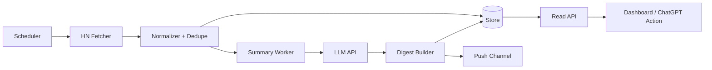

# Hacker News 摘要推送 Agent 方案

## 项目目标

构建一个 Go 后台服务，定时从 Hacker News 官方 API 拉取内容，筛选值得关注的 story，调用 LLM 生成结构化中文摘要，并推送到指定渠道。

## MVP 范围

- 拉取 `topstories`。
- 拉取 story item 详情。
- 做本地去重。
- 生成中文摘要。
- 保存 digest。
- 暴露健康检查接口。
- 支持手动触发一次 digest 生成。

## 推荐架构



## 包结构草案

```text
hn-agent/
  cmd/hn-agent/
  internal/config/
  internal/hn/
  internal/summary/
  internal/digest/
  internal/store/
  internal/notifier/
  internal/httpapi/
  internal/obs/
```

## API 草案

| 方法 | 路径 | 作用 |
| --- | --- | --- |
| `GET` | `/healthz` | 健康检查 |
| `GET` | `/metrics` | Prometheus 指标 |
| `POST` | `/api/v1/jobs/fetch` | 手动触发抓取 |
| `POST` | `/api/v1/jobs/digest` | 手动生成 digest |
| `GET` | `/api/v1/stories?source=top&limit=20` | 查询 story |
| `GET` | `/api/v1/digests/latest` | 查询最新摘要 |

## 验收标准

- 单次抓取失败不会导致服务崩溃。
- 外部 API 调用都有 timeout。
- 摘要生成失败时有错误记录和可重试空间。
- 同一条 story 不会重复推送。
- 关键逻辑有单元测试。
